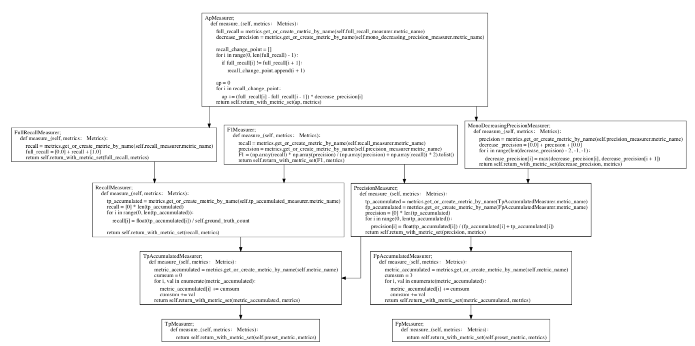

# For Those Who What to Understand mAP

This code is a refactored version of https://github.com/Cartucho/mAP

## How to use it:

### Prepare ground-truth and detections
put your ground-truth and detections into [src/measure/input](src/measure/input)

#### Create the ground-truth files

- Create a separate ground-truth text file for each image.
- Use **matching names** for the files (e.g. image: "image_1.jpg", ground-truth: "image_1.txt").
- In these files, each line should be in the following format:
    ```
    <class_name> <left> <top> <right> <bottom>
    ```
- E.g. "image_1.txt":
    ```
    tvmonitor 2 10 173 238
    book 439 157 556 241
    book 437 246 518 351 difficult
    pottedplant 272 190 316 259
    ```

#### Create the detection-results files

- Create a separate detection-results text file for each image.
- Use **matching names** for the files (e.g. image: "image_1.jpg", detection-results: "image_1.txt").
- In these files, each line should be in the following format:
    ```
    <class_name> <confidence> <left> <top> <right> <bottom>
    ```
- E.g. "image_1.txt":
    ```
    tvmonitor 0.471781 0 13 174 244
    cup 0.414941 274 226 301 265
    book 0.460851 429 219 528 247
    chair 0.292345 0 199 88 436
    book 0.269833 433 260 506 336

## Show the code logic

you can run code in [src/measure/measurer.py](src/measure/measurer.py) and it will show you the metrics calculation dependencies.

### Example result



